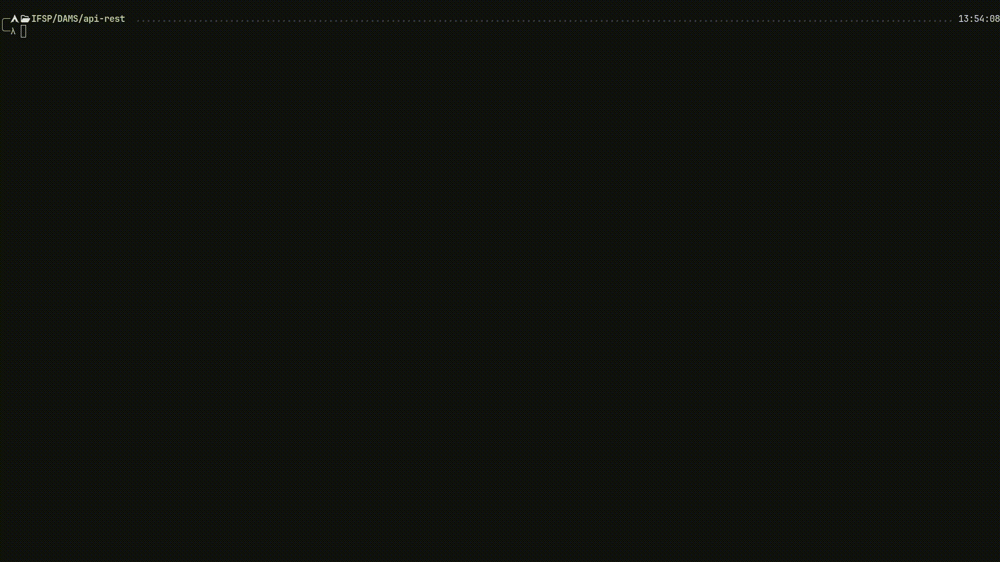
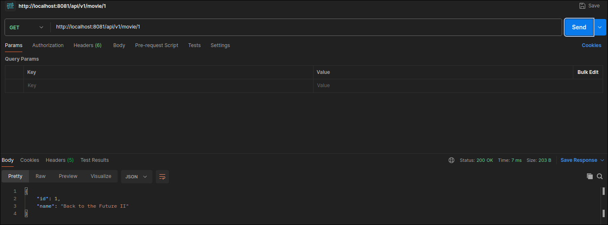
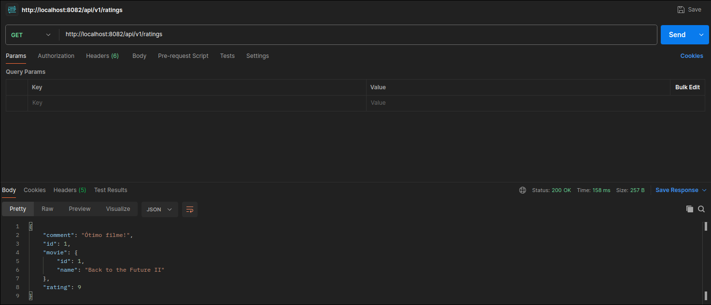
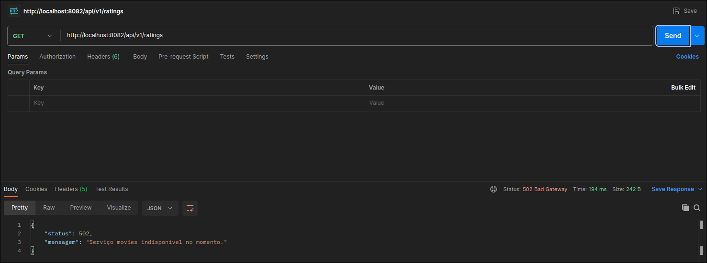
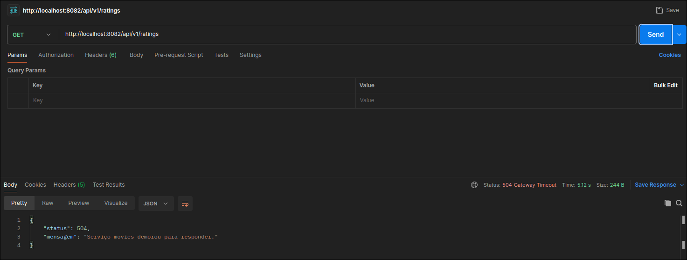

# Comunicação Síncrona entre Microsserviços Spring Boot

Atividade da matéria PTBDAMS (Desenvolvimento de APIs e Microsserviços).

## 1. Funcionamento Integrado:

Para rodar o projeto é necessário executar:

```bash
git clone http://github.com/Veketi/comunicacao-microsservicos.git
cd ./comunicacao-microsservicos 
docker compose up --build
```



Após rodar será possível acessar dois endpoints:

- [http://localhost:8081/api/v1/movie/{id}](http://localhost:8081/api/v1/movie/1)



- [http://localhost:8082/api/v1/ratings](http://localhost:8082/api/v1/ratings)



## 2. Simulação de falha de comunicação entre serviços:

Para simular uma falha de comunicação execute o seguinte:

```bash
docker compose stop movies
```

Quando tentar acessar o endpoint [http://localhost:8082/api/v1/ratings](http://localhost:8082/api/v1/ratings) você terá essa resposta:



## 3. Simulação de timeout na comunicação entre serviços:

Para simular um timeout na comunicação entre serviços execute o seguinte:

### 3.1. Alterar o serviço movies:

-  Acesse o projeto no seu editor de texto ou IDE favorita.

- Na pasta ` /movies/src/main/java/edu/ifsp/movies/controller/` altere o arquivo `MovieController.java`:

```java
// Adicione "throws InterruptedException" na assinatura do método:
public Movie index(@PathVariable Integer id) throws InterruptedException 


// Adione a linha abaixo antes do retorno do método:
Thread.sleep(5000);
```


### 3.2. Rodar novamente e fazer uma requsição para ratings:

```bash
#Entre na raiz do projeto:
../

#Execute a aplicação novamente:
docker compose up --build
```

Quando executar uma requisição no endpoint [http://localhost:8082/api/v1/ratings](http://localhost:8082/api/v1/ratings) isso irá ocorrer:



## 4. Problemas que podem ocorrer:

No desenvolvimento de microsserviços podem ocorrer diversos problemas, como os seguintes:

- **Acoplamento Temporal:** Um serviço depende do outro para funcionar corretamente. Caso o serviço `movies` esteja fora do ar, o serviço `ratings` irá falhar junto.

- **Consistência de dados:** Como cada serviço tem o seu próprio banco de dados, garantir que os dados estejam sincronizados é um desafio.

- **Overhead de rede:** O que era uma chamada de função antes, agora passa ser uma requisição via rede. O que adiciona latência e pode degradar performance.

- **Dificuldade para debugar:** Em um chamada que passa por diversos serviços, pode ser dificil de rastrear onde erros estejam ocorrendo.

- **Complexidade operacional:** Manter, fazer deploy e monitorar muitos serviços independentes é muito mais complexo do que em aplicações monolíticas.
